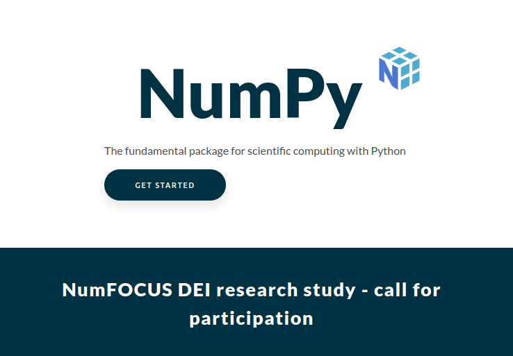

# University of Moratuwa

https://uom.lk/itfac/departments/department-of-information-technology

# The Certificate

# Python

# Immutability of Numbers

# Common GUI Libraries

- PyQT5
- Tkinter

# Numpy

# SciPy

# MatPotLib

## Pandas, SciKit Learn, TensorFlowh

# Roles in Software Development

- Product Owner
- Engineering Manager
- Business Analysts
- Software Engineers
- Software Architect
- UX Designer
- QA Engineer

# Sri Lanka IT Industry

